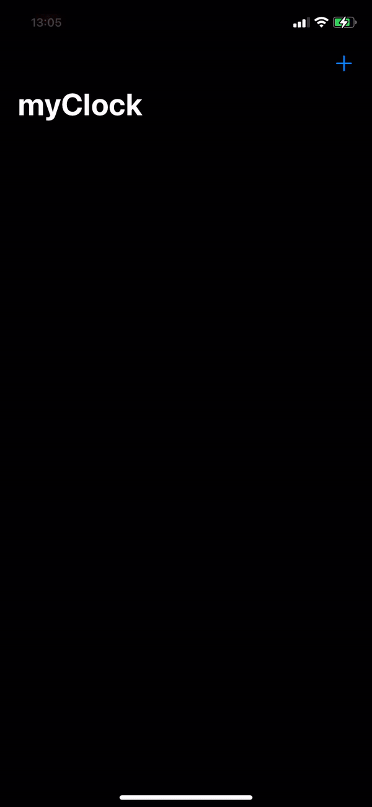
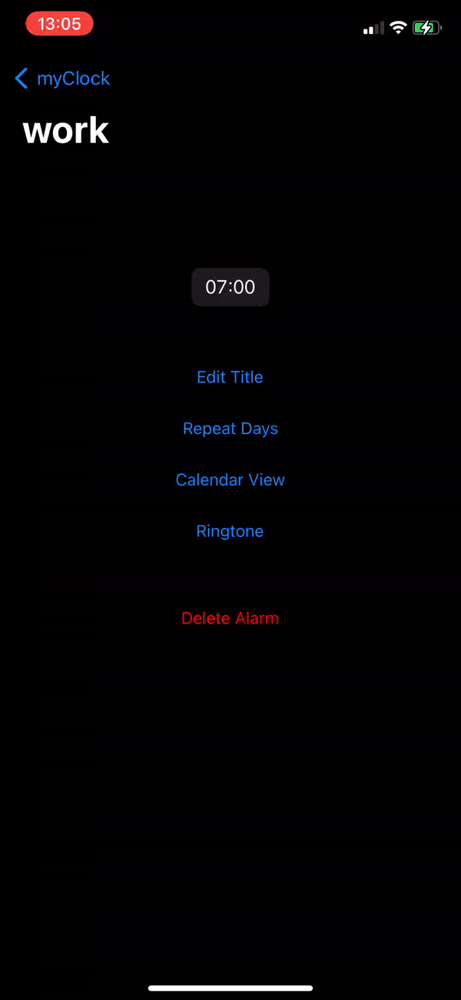
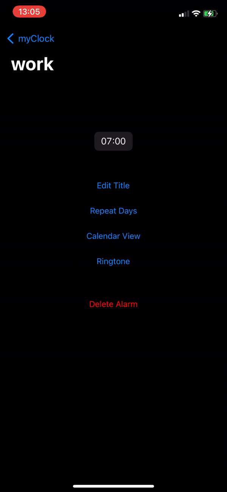
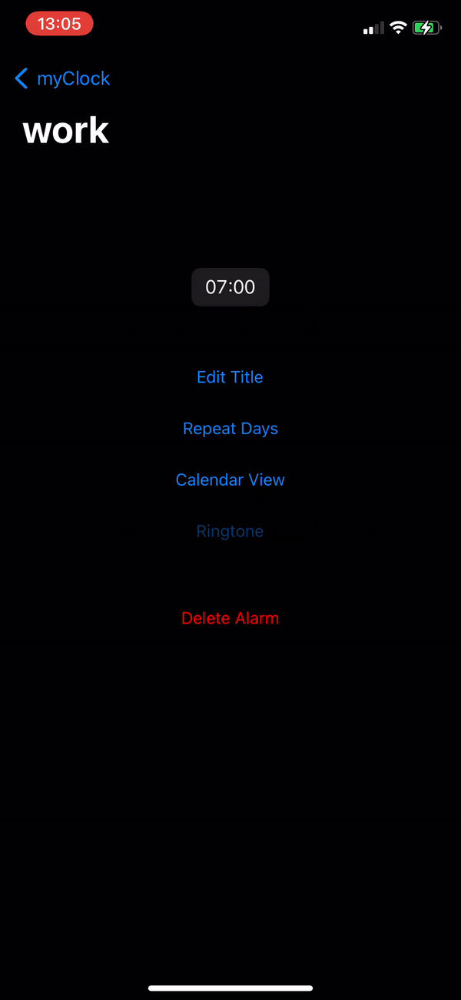
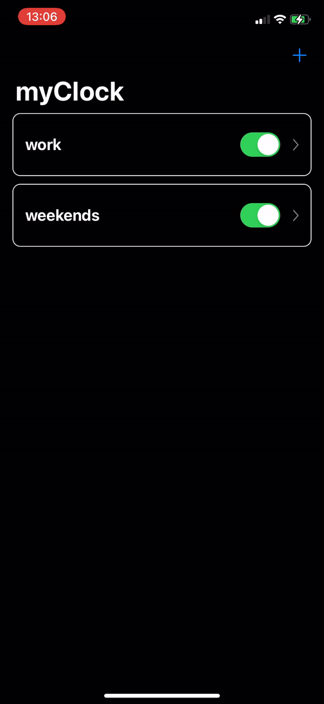
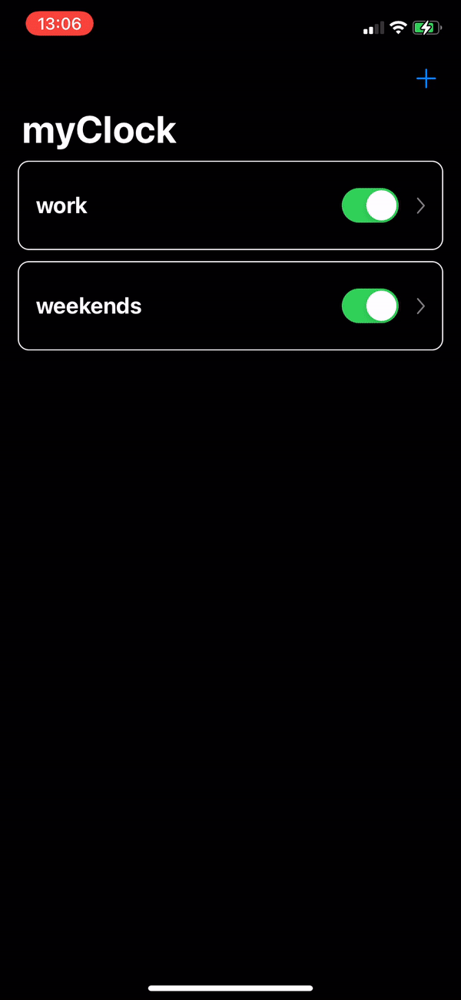
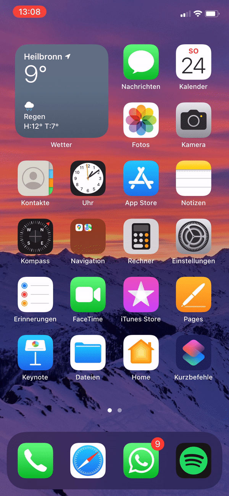
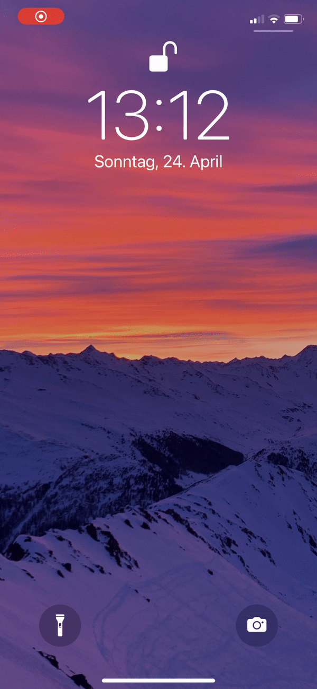

# Swift_alarm_clock
* This is an alarm clock app, where you can schedule your alarms in a calendar view.  
* This grants that you don't have to think about stopping your alarms for holidays and reschedule them afterwards.

## Contributors
[42 Heilbronn](https://www.42heilbronn.de/en/) students:
[Robin](https://github.com/Radel-24), [Alex](https://github.com/42akurz)

## Add a new alarm
* Set alarm name
* Set alarm clock

## Repeat Days
* You can choose the weekdays where your alarm will ring when activated
* The repeat days will be marked in the "Calendar View"

## Calendar View
* In "Calendar View" you can activate/deactivate the alarm on specific days (in case of vacation)
* The alarm will ring only on selected days (red) 

## Select Ringtone
* You can set the ringtone of your choice

## Switch Alarm on / off

## Delete alarm

## Alarm notification with ringtone

