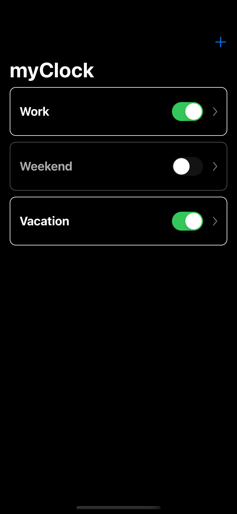
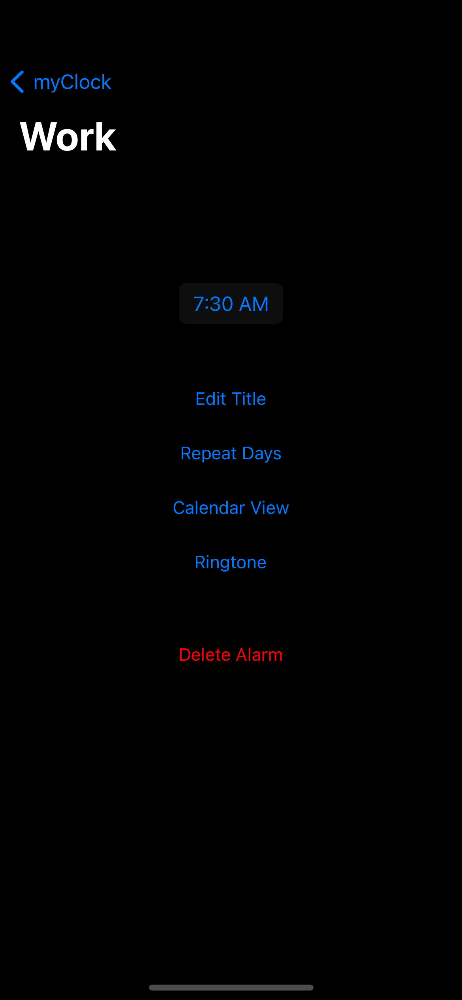
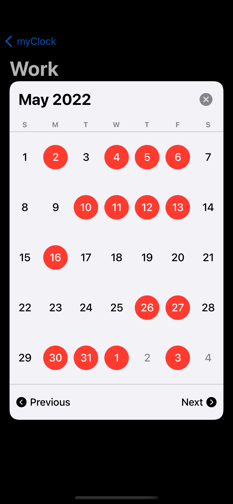

# Swift_alarm_clock
This is an alarm clock app, where you can schedule your alarms in a calendar view. This grants that you don't have to think about stopping your alarms for holidays and reschedule them afterwards.

